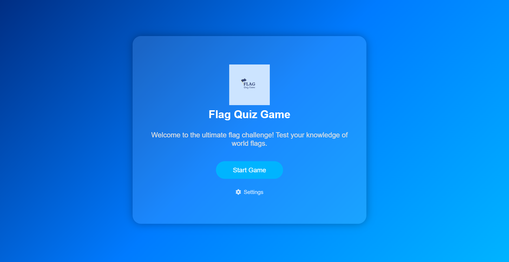
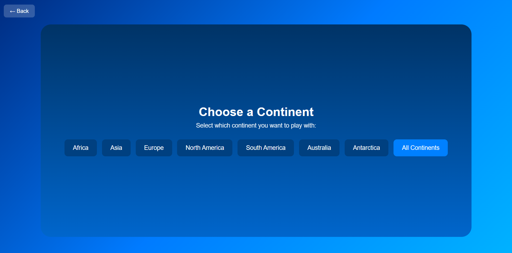
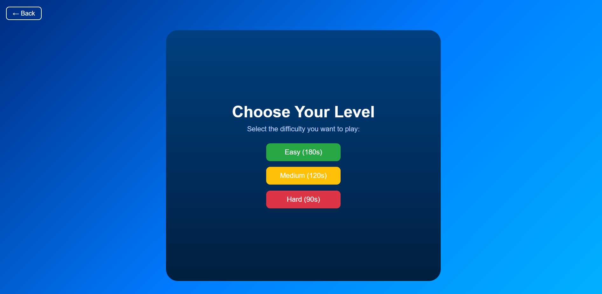
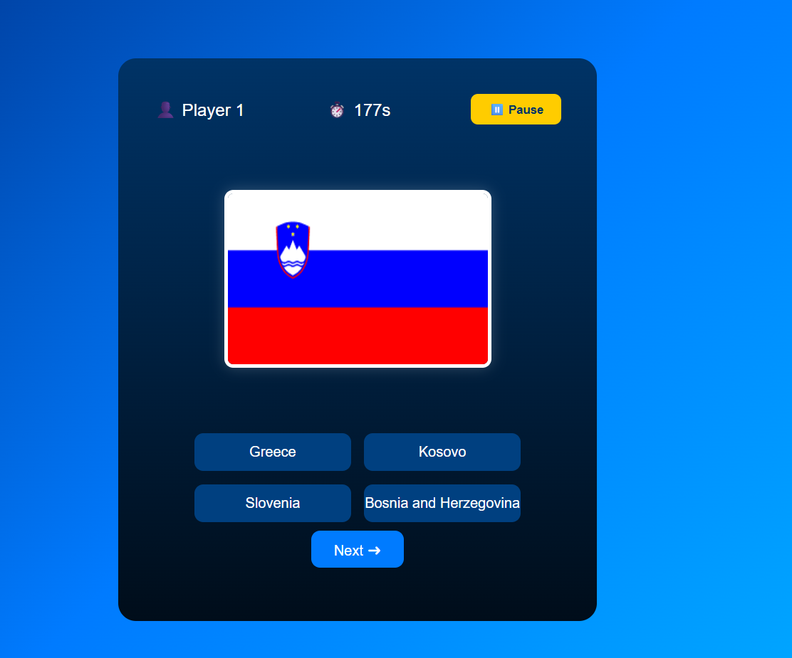

# 🌍 Flag Quiz Game


Flag Quiz Game is an interactive educational web application designed to help users improve their knowledge of world geography through country flag recognition.


Players can test their knowledge by selecting a continent, choosing a difficulty level, and identifying the correct country associated with each displayed flag. The game includes a scoring system and a countdown timer, creating an engaging and competitive learning experience.


---


## 📸 Screenshots


### Start Game





### Choose Continent





### Choose Difficulty





### Gameplay





---


## ✨ Features


* Continent-based flag quiz

* Difficulty levels: Easy, Medium, Hard

* Randomized flags and answer options

* Countdown timer

* Score calculation

* Automatic score saving as `Anonymous`

* ASP.NET Core backend API

* SQL Server database integration

* Simple and responsive frontend design


---


## 🕹️ How to Play


1. Open `index.html` in your browser.

2. Click **Start Game**.

3. Select a continent.

4. Choose a difficulty level.

5. Identify the correct country for each displayed flag.

6. The game ends when all flags have been shown or when the time runs out.

7. The score is saved automatically in the local database.


---


## 🛠️ Technologies Used


### Backend


* ASP.NET Core 7

* Entity Framework Core

* SQL Server


### Frontend


* HTML5

* CSS3

* JavaScript


### External Services

* RestCountries API


---


## 📁 Project Structure


```text

FlagQuizGame/

├── wwwroot/

│   ├── images/                  # Application images and flag assets

│   ├── continent.html            # Continent selection page

│   ├── game.html                 # Main quiz gameplay page

│   ├── index.html                # Start page

│   ├── level.html                # Difficulty selection page

│   ├── script.js                 # Frontend JavaScript logic

│   └── style.css                 # Main stylesheet

│

├── Controllers/

│   ├── FlagsController.cs        # API controller for flag data

│   └── GameResultsController.cs  # API controller for saving game results

│

├── Data/

│   └── ApplicationDbContext.cs   # Entity Framework database context

│

├── Images/

│   ├── 1.png                     # Start game screenshot

│   ├── 2.png                     # Choose continent screenshot

│   ├── 3.png                     # Choose difficulty screenshot

│   └── 4.png                     # Gameplay screenshot

│

├── Models/

│   └── GameResults.cs            # Game result model

│

├── Program.cs                    # Application entry point

└── README.md                     # Project documentation

```


---


## ⚙️ Getting Started


### Prerequisites


Make sure you have installed:


* .NET 7 SDK

* SQL Server

* Visual Studio 2022 or Visual Studio Code


---


## 🚀 Installation


1. Clone the repository:


```bash

git clone https://github.com/BesianaDauti/FlagQuizGame.git

```


2. Open the project folder:


```bash

cd FlagQuizGame

```


3. Configure the database connection string in `appsettings.json`.


4. Apply migrations or create the database using the included SQL scripts.


5. Run the project:


```bash

dotnet run

```


6. Open the application in your browser.


---


## 🗄️ Database


The project uses SQL Server to store game results.


For the public GitHub version, the actual database file is not included. Only the required structure or scripts should be shared.


Scores are saved with the default player name:


```text

Anonymous

```


---


## 🌐 External API


This project uses the RestCountries API to retrieve country information and flag images.


- API: https://restcountries.com/

- Data used:

  - Country names

  - Flag images

  - Continent/region information


The API is used by the ASP.NET Core backend to dynamically provide flag quiz data to the frontend.


---


## 🎯 Educational Purpose


This project was developed to practice and demonstrate:


* ASP.NET Core Web API development

* Entity Framework Core database integration

* SQL Server usage

* Frontend and backend communication

* JavaScript game logic

* Responsive web interface design


---


## 📌 Notes


* The database file is not included in the repository.

* Screenshot images are stored in the `Images/` folder.

* Static frontend files are stored inside the `wwwroot/` folder.


---


## 📄 License


This project is created for educational purposes.
